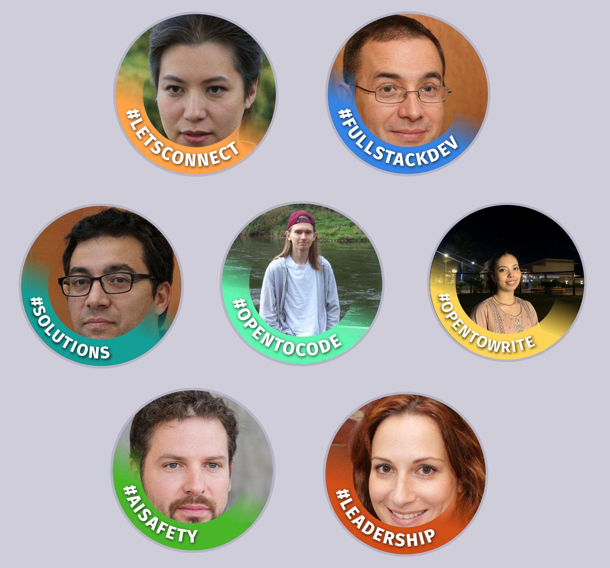

# LinkedIn Banner Creator

It's often argued that #OPENTOWORK may negatively affect your chances on LinkedIn as so many people have this banner and recruiters may see this as desperate. That's why I aim to make this banner more unique and tailored to users. Stand out from the crowd using text and color that matches you.

[View Live Website](https://linkedinbanner.warze.org)

	

